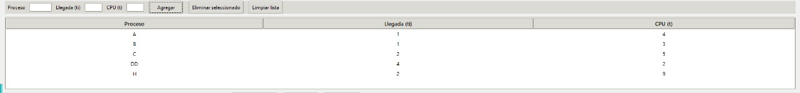

# Simulador de Planificación de CPU – FCFS / SJF / RR (Tkinter)

## Requisitos
- Python 3.9+
- Tkinter (incluido en la instalación estándar de Python).

## Estructura
```
src/
 ├─ main.py        # arranque de la app
 ├─ gui.py         # interfaz y animación
 ├─ simulator.py   # núcleo de algoritmos (FCFS, SJF, RR)
 ├─ utils.py       # colores, fuentes y constantes
 └─ __init__.py
```

## Ejecutar
```bash
python -m src.main
```
o
```bash
python src/main.py
```
(Dependiendo de tu IDE/entorno).

## Notas
- Unidad de tiempo por defecto: 3 s (configurable).
- Resultados se muestran al final con métricas `tf, T, Te, I` (2 decimales) y promedio.
- En RR se muestra la cola en tiempo real. Llegadas se encolan antes que reencolados por quantum.

## Capturas de funcionamiento
|  | Interfaz inicial con lista de procesos y controles, mostrando los nombes de los procesos, tiempo de llegada y uso de CPU |

