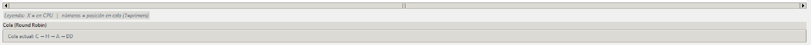

# Simulador de procesos implementando Algoritmos de Planificación

## Requisitos
- Python 3.9+
- Tkinter (casi siempre viene con python cuando se instala).

## Estructura
```
src/
 ├─ main.py        # arranque de la app
 ├─ gui.py         # interfaz y animación
 ├─ simulator.py   # núcleo de algoritmos (FCFS, SJF, RR)
 ├─ utils.py       # colores, fuentes y constantes
```

## Ejecutar
```bash
python -m src.main
```
o
```bash
python src/main.py
```
(Dependiendo de tu IDE/entorno o la version de python).


## Capturas de funcionamiento
   Interfaz inicial con lista de procesos y controles, mostrando los nombes de los procesos, tiempo de llegada y uso de CPU 

  Ejemplo de ejecución FCFS mostrando el diagrama aprendido en clase 




Ejemplo de Round Robin con la cola activa y quantum aplicado, usando los mismos datos del ejemplo de FCFS

  Tabla de resultados con métricas y promedio del índice de servicio (para RR en este caso)

## Notas
- Por Default las unidades de tiempo estan en 3 segundos
- Resultados se muestran al final con métricas `tf, T, Te, I` (2 decimales) y promedio.
- En RR se muestra la cola en tiempo real. Llegadas se encolan antes que reencolados por quantum.

